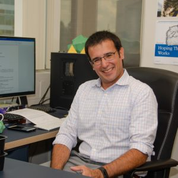

--- 
layout: page
title : People 
permalink: /People/
feature-img: "assets/img/peoplepic.jpg"
---

---

  <h2>Principal Investigator</h2>

---
### Luigi E. Perotti
---

 Dr. Perotti received his Laurea (B.S./M.S.) in Civil Engineering from Politecnico di Milano, Italy and his M.S. and Ph.D. in Mechanical Engineering from the California Institute of Technology. His graduate studies focused on developing new finite element methods for thin shells and on solving high-rate fluid-solid interaction problems. As a postdoctoral scholar at UCLA, he applied the continuum and computational mechanics tools he learned during his Ph.D to understand the electrophysiology and mechanics of the healthy and failing heart and the conformational changes occurring during the maturation of viral capsids. As an Assistant professor at the University of Central Florida in the MAE department, Dr. Perotti continues the study of cardiac kinematics and function by combining computational mechanics and medical images (e.g., MR and CT). Furthermore, he and his group explore thin shell morphing structures inspired by the maturation of viral capsids.

\
Favorite things to do: Kayak Polo and Backcountry Hiking\
Links: [Google Scholar](https://scholar.google.com/citations?user=caVccQEAAAAJ&hl=en),  [LinkedIn](https://www.linkedin.com/in/luigi-e-perotti-440088122/)

 

---

  <h2>Current Graduate Students</h2>

---
### Shah Wasif Sazzad
---

Wasif received his B.Sc in Mechanical Engineering from Bangladesh University of Engineering and Technology (BUET). He has a M.S. in Mechanical Engineering and currently pursuing a Ph.D. degree specializing in developing efficient algorithms for particle cluster triangulation and visualization based on physical interactions. He has excellent experience working with C/C++ and Python with a decent knowledge of data structures and algorithms. The goal of his current research is to create elasticity inspired compact unfolding of 3D shapes. This type of unfolding will open doors for efficient deployable structures design. 

 
Favorite things to do: Soccer, Hiking, Competitive Programming\
Links: [LinkedIn](https://www.linkedin.com/in/shah-wasif-sazzad/), [Google Scholar](https://scholar.google.com/citations?user=YZSoh14AAAAJ&hl=en)

 
 

---
### Augusto Devald Marques
---

 

Augusto received his B. Sc. and M.S. in Mechanical Engineering from the Federal University of Rio Grande do Sul (UFRGS), Brazil. 
His Ph.D. research includes cardiac kinematics, finite element analysis, and machine learning with the goal of building patient-specific heart models. 

 
 
Favorite things to do:	     \
Links: 

 
 

---
### Uditha Weerasinghage
---

Uditha received his B.Sc and M.Sc in Engineering at the University of Moratuwa, Sri Lanka. For his undergraduate thesis, he worked on homogenization of woven composites for deployable space structures using multiscale modeling techniques. For his masters thesis, he investigated the non-linear bending behaviour of ultra thin woven composites at the meso-mechanical scale. Currently, he is pursuing his Ph.D in Biomedical Engineering. The goal of his research is to investigate the ventricular motion in active contraction and reveal how cellular and meso-scale changes are reflected in ventricular function and dysfunction. 

 
Favorite things to do: Reading, Traveling, Bike touring
Links: [LinkedIn](https://www.linkedin.com/in/udithadweerasinghe/), [Google Scholer](https://scholar.google.com/citations?hl=en&user=WVJMR90AAAAJ)

 
 

---
### Pedro Botecchi
---

Uditha received his B.Sc and M.Sc in Engineering at the University of Moratuwa, Sri Lanka. For his undergraduate thesis, he worked on homogenization of woven composites for deployable space structures using multiscale modeling techniques. For his masters thesis, he investigated the non-linear bending behaviour of ultra thin woven composites at the meso-mechanical scale. Currently, he is pursuing his Ph.D in Biomedical Engineering. The goal of his research is to investigate the ventricular motion in active contraction and reveal how cellular and meso-scale changes are reflected in ventricular function and dysfunction. 

 
Favorite things to do: Reading, Traveling, Bike touring
Links: [LinkedIn](https://www.linkedin.com/in/udithadweerasinghe/), [Google Scholer](https://scholar.google.com/citations?hl=en&user=WVJMR90AAAAJ)

 
 

---

  <h2>Current Undergraduate Students</h2>

---

<!---
### Sarah Bulger (Working on HUT)

 

Sarah is a senior mechanical engineering student at the University of Central Florida. She hopes to work in the biomedical engineering field. She is completing an undergraduate research thesis through UCF’s Burnett Honors College that links the cardiac structure at the micro, meso, and macro scale. She’s also helping work on a liquid bi-propellant rock with UCF’s Knights Experimental Rocketry club that is estimated to be 15 ft tall and launch to 10,000 ft. 

 
Favorite things to do: Baking and taking care of my plants \
Links: [LinkedIn](www.linkedin.com/in/sarah-bulger-aa8a41293)

 

-->

<h4> Luigi Wellner  </h4> 

 Luigi current research focuses on cardiac image segmentation to train machine learning models for automatic image processing and cardiac strain calculations from clinical MR images routinely acquired in the clinic. 

<h4> Tyler Gregson  </h4>

 Tyler current research focuses on deployable structures and manufacturing optimization. As part of his research, Tyler 3D prints and optimizes the ptototypes of deployable structures designed in the lab. 

<h4> Nivedha Srinivasan  </h4>

 Niv current research focuses on developing the tools and pipeline to characterize bone structures (e.g., volume fraction, branching) from CT images. 

---

  <h2>Past Graduate Students</h2>

---

<h4>Mehlil Ahmed (PhD) </h4> Links: [Google Scholar](https://scholar.google.com/citations?user=0uJzfcIAAAAJ&hl=en&oi=ao), [LinkedIn](https://www.linkedin.com/in/mehlil-ahmed-b80921132/) 
<h4>Andre Von Zuben (PhD) </h4> Links: [ResearchGate](https://www.researchgate.net/profile/Andre-Von-Zuben), [LinkedIn](https://www.linkedin.com/in/avzuben/) 
<h4>Kajetan Fricke (PhD) </h4> Links: [Google Scholar](https://scholar.google.com/citations?hl=en&user=DNzBtfUAAAAJ&view_op=list_works&sortby=pubdate), [LinkedIn](https://www.linkedin.com/in/kajetan-fricke/) 
<h4>Tanjib Rahman (MS) </h4> Links: [Google Scholar](https://scholar.google.com/citations?user=7ERCrjYAAAAJ&hl=en&oi=ao), [LinkedIn](https://www.linkedin.com/in/tanjib/) 
